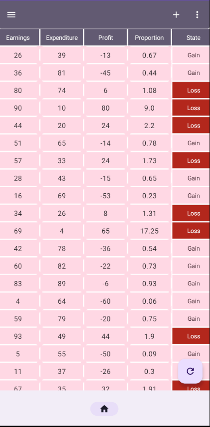

# Kabular

# Welcome to Kabular
Kabular is a miniature one-screen app displaying a table of a typical E-commerce. The data is
obtained via a local Room database.

# Technologies
- Kotlin
- Jetpack compose
- Coroutines
- Jetpack compose
- Room
- MVVM
- Clean Architecture
- SOLID

## Showcase

     &nbsp; 
     &nbsp; 
     &nbsp; 
     &nbsp; 

## Install
Git clone the project and build it locally on your machine, or obtain it from
the [Releases](https://github.com/xquilt/kabular/releases) sections

## Contributing
Pull requests are welcome. For major changes, please open an issue first to discuss what you would
like to change.

## License
[MIT](./LICENSE)
